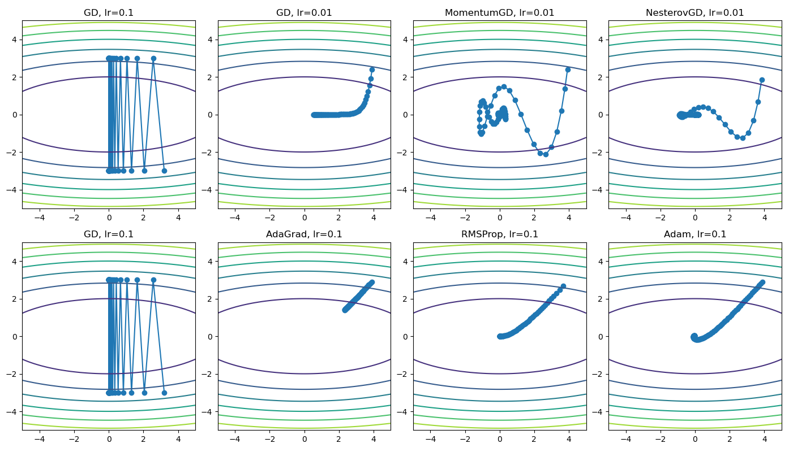

在深度学习领域，优化器是必不可少的组件。深度学习将分类或回归问题建模成一个优化问题，而优化器负责调整模型的内部参数（如权重和偏置），以最小化损失函数。这个过程就像是登山者在迷雾中寻找山谷的最低点，而优化器就是为登山者提供方向和步幅的向导。一个好的优化器能够帮助模型更快、更稳定地收敛，找到一个更好的参数组合，从而提升模型的性能。从基础的梯度下降到更复杂的Adam和RMSProp，优化器是模型训练成功的关键，它决定了模型学习的效率和最终的预测精度。

通常情况下，我们只需调用 `torch.optim` 模块中的优化器即可轻松完成训练。例如，`torch.optim.Adam` 几乎可以解决大多数问题，但如果能自己手动实现这些优化器，可以极大地加深对它们的理解。手动实现优化器能让你从**数学公式层面**去剖析其工作原理，理解动量、自适应学习率等核心概念是如何通过代码被转化为实际的参数更新。这个过程不仅能让你更好地掌握每个优化器的特性和适用场景，还能在遇到模型收敛困难时，帮助你更精准地排查问题。接下来，我们将一步步手动实现从**梯度下降**到的**Adam**算法，深入剖析**动量、Nesterov、Adagrad**和**RMSProp**等核心优化算法的实现细节。

## 一、梯度下降（GD）

梯度下降是深度学习领域最简单也是使用最普遍的算法之一，它通过沿着函数最陡峭的下降方向（即梯度的负方向）迈出一步，逐步逼近函数的最小值。用公式表示就是

$$
x_{t+1} \leftarrow x_t - \eta \nabla_x L(x_t)
$$

在Pytorch中，函数对变量的梯度可以通过函数的`backward()`方法进行反向传播，计算出的梯度保存在变量的`grad`属性中。因此我们可以定义一个`GD`类，其中`step()`方法进行一次梯度下降（注意需要`torch.no_grad()`避免自减过程中更新动态计算图导致死循环），`zero_grad()`方法将变量的梯度置0，为下一次迭代做准备。代码如下。

```Python
class GD:
    def __init__(self, x, lr=0.01):
        self.x = x
        self.lr = lr

    def step(self):
        with torch.no_grad():
            self.x -= self.lr * self.x.grad

    def zero_grad(self):
        self.x.grad.zero_()
```

## 二、带动量的梯度下降（MomentumGD）

标准的梯度下降容易实现且效果较好。然而，标准梯度下降有一个明显的缺点：它的每一步更新都只取决于当前位置的梯度，缺乏对过往移动方向的“记忆”，这在优化过程中容易产生不必要的震荡。为了保留历史信息，可以引入一个“动量”项，根据当前位置的梯度更新“动量”项，从而在加速收敛的同时，减少震荡并帮助算法更平稳地通过平坦区域。用公式表示就是

$$
v_{t+1} \leftarrow \mu v_{t} + \nabla_x L(x_t) 
$$

$$
x_{t+1} \leftarrow x_t - \eta v_{t+1}
$$

这里“动量”项的更新采用了指数滑动平均的形式，可以使算法能够抛弃那些非常久远的梯度，保留较近的梯度信息。代码如下。

```Python
class MomentumGD:
    def __init__(self, x, lr=0.01, momentum=0.9):
        self.x = x
        self.lr = lr
        self.momentum = momentum
        self.v = torch.zeros_like(x)

    def step(self):
        with torch.no_grad():
            self.v = self.momentum * self.v + self.x.grad
            self.x -= self.lr * self.v
    
    def zero_grad(self):
        self.x.grad.zero_()
```

## 三、Nesterov梯度下降（Nesterov GD）

和带动量的梯度下降类似，第一类Nesterov梯度下降也是通过引入“动量”项减小震荡、加速收敛。但不同的是Nesterov使用的是超前点处的梯度计算动量，具有前瞻性，通常比动量法收敛得更快。用公式表示就是

$$
v_{t+1} \leftarrow \mu v_t + \nabla_x L(x_t - \eta\mu v_t)
$$

$$
x_{t+1} \leftarrow x_t - \eta v_{t+1}
$$

但是如果按照这个公式进行实现，超前点处的梯度需要重新计算，带来了不必要的计算开销。因此我们令$$x_t' = x_t - \eta\mu v_t$$，这样第二个迭代可以写为

$$
\begin{aligned} x'_{t+1} &= x_{t+1} - \eta\mu v_{t+1} \\ &= x_t - \eta v_{t+1} - \eta\mu v_{t+1} \\ &= x_t' - \eta v_{t+1} + \eta\mu v_t - \eta\mu v_{t+1} \\ &= x_t' - \eta \nabla_xL(x_t') - \eta\mu v_{t+1} \end{aligned}
$$

因此第一类Nesterov梯度下降可以等价表示为

$$
v_{t+1} \leftarrow \mu v_t + \nabla_x L(x_t')
$$

$$
x_{t+1}' \leftarrow x_t' - \eta (\nabla_x L(x_t') + \mu v_{t+1})
$$

相当于我们更新的是超前点处的位置，而更新的方向是当前位置的梯度方向与动量方向的线性组合。事实上，PyTorch中的原生Nesterov梯度下降也是这么实现的。据此，我们可以写出如下代码。

```Python
class NesterovGD:
    def __init__(self, x, lr=0.01, momentum=0.9):
        self.x = x
        self.lr = lr
        self.momentum = momentum
        self.v = torch.zeros_like(x)

    def step(self):
        with torch.no_grad():
            self.v = self.momentum * self.v + self.x.grad
            self.x -= self.lr * (self.x.grad + self.momentum * self.v)
            
    def zero_grad(self):
        self.x.grad.zero_()
```

## 四、AdaGrad

MomentumGD、NesterovGD解决了梯度下降只依赖当前位置处的梯度信息的问题。但梯度下降还有另一个问题：所有维度的学习率都是一样的。但不同维度由于取值范围的不同，其梯度可能存在数量级上的差异，收敛速率也会不同，从而产生某一维度接近收敛而另一维度远远没有收敛的情况。AdaGrad算法解决了这一问题：每个参数的当前学习率与其过去所有梯度平方之和的平方根成反比。关于损失函数有较大偏导的参数，其学习率会有较大的衰减；而偏导数较小的参数的学习率变化相对较小。换句话说，AdaGrad对每个维度的梯度进行了尺度变换，使得不同维度间的梯度大小是可比拟的。用公式表示就是

$$
x_{t+1} \leftarrow x_t - \eta \frac{1}{\sqrt{\sum_{i = 1}^t (\nabla_x L(x_i))^2} + \epsilon}\odot \nabla_x L(x_t)
$$

这里向量间乘法是逐元素（element-wise）进行的，$$\epsilon = 10^{-8}$$防止除0。具体实现时，我们可以维护一个变量$$h_t$$储存过去所有梯度的平方和，这样迭代公式就可以写为

$$
h_{t+1} \leftarrow h_t + (\nabla_x L(x_t))^2
$$

$$
x_{t+1} \leftarrow x_t - \eta \frac{1}{\sqrt{h_{t+1}} + \epsilon} \odot \nabla_x L(x_t)
$$

代码如下。

```Python
class AdaGrad:
    def __init__(self, x, lr=0.01, eps=1e-8):
        self.x = x
        self.lr = lr
        self.h = torch.zeros_like(x)
        self.eps = eps

    def step(self):
        with torch.no_grad():
            self.h += self.x.grad ** 2
            self.x -= self.lr * self.x.grad / (self.h ** 0.5+ self.eps)
    
    def zero_grad(self):
        self.x.grad.zero_()
```

## 五、RMSProp

与Adagrad类似，RMSProp也解决了自适应学习率的问题。但RMSProp将 AdaGrad 中的累计平方梯度变为指数滑动平均的形式**。**指数滑动平均方式使得算法能够抛弃那些非常久远的梯度, 使得算法的收敛速度更快。用公式表示就是

$$
h_{t+1} \leftarrow \alpha h_t + (1 - \alpha)(\nabla_x L(x_t))^2
$$

$$
x_{t+1} \leftarrow x_t - \eta \frac{1}{\sqrt{h_{t+1}} + \epsilon} \odot \nabla_x L(x_t)
$$

代码如下

```Python
class RMSProp:
    def __init__(self, x, lr=0.01, alpha=0.9, eps=1e-8):
        self.x = x
        self.lr = lr
        self.h = torch.zeros_like(x)
        self.alpha = alpha
        self.eps = eps

    def step(self):
        with torch.no_grad():
            self.h = self.alpha * self.h + (1 - self.alpha) * self.x.grad ** 2
            self.x -= self.lr * self.x.grad / (self.h + self.eps) ** 0.5
    
    def zero_grad(self):
        self.x.grad.zero_()
```

## 六、Adam

Adam 算法可以被看作是**Momentum**和**RMSProp**两种优化算法的集大成者。它在训练过程中，维护并更新两个指数移动平均值：

1. **一阶矩估计（**$$v_t$$**）**：这是梯度的指数移动平均，类似于 Momentum 中的动量项。它决定了参数更新的方向，使得更新具有“惯性”，能够有效减少震荡并加速收敛。
2. **二阶矩估计（**$$h_t$$**）**：这是梯度平方的指数移动平均，类似于 RMSProp。它通过梯度的平方来为每个参数创建一个自适应的学习率，确保频繁更新的参数学习率不会过高，而稀疏更新的参数也能得到有效学习。

Adam 的核心优势在于，它**同时利用了梯度的一阶信息和二阶信息**。它既有 Momentum 算法的平滑和加速效果，又有 RMSProp 的自适应学习率能力，从而在大多数深度学习任务中表现出极佳的稳定性和收敛速度。因此，它成为了目前最常用、最稳定的默认优化器之一。用公式表示就是

$$
t \leftarrow t+1
$$

$$
v_{t+1} \leftarrow \beta_1 v_t + (1 - \beta_1)\nabla_x L(x_t) 
$$

$$
h_{t+1} \leftarrow \beta_2 h_t + (1 - \beta_2)(\nabla_x L(x_t))^2
$$

$$
\hat{v}_{t+1} \leftarrow \frac {v_{t+1}}{1 - \beta_1^t}
$$

$$
\hat{h}_{t+1} \leftarrow \frac {h_{t+1}}{1 - \beta_2^t}
$$

$$
x_{t+1} \leftarrow x_t - \eta \frac{1}{\sqrt{\hat{h}_{t+1}} + \epsilon} \odot \hat{v}_{t+1}
$$

代码如下。

```Python
class Adam:
    def __init__(self, x, lr=0.01, beta1=0.9, beta2=0.999, eps=1e-8):
        self.x = x
        self.lr = lr
        self.beta1 = beta1
        self.beta2 = beta2
        self.eps = eps
        self.v = torch.zeros_like(x)
        self.h = torch.zeros_like(x)
        self.t = 0

    def step(self):
        self.t += 1
        with torch.no_grad():
            self.v = self.beta1 * self.v + (1 - self.beta1) * self.x.grad
            self.h = self.beta2 * self.h + (1 - self.beta2) * self.x.grad ** 2
            v_hat = self.v / (1 - self.beta1 ** self.t)
            h_hat = self.h / (1 - self.beta2 ** self.t)
            self.x -= self.lr * v_hat / (h_hat.sqrt() + self.eps)
    
    def zero_grad(self):
        self.x.grad.zero_()    
```

## 七、算法测试

我们使用$$f(x_1, x_2) = x_1^2 + 10 x_2^2$$对各个算法进行测试并进行可视化，其结果如下所示。可以看到，当梯度下降的学习率过大时，参数无法收敛；当学习率过小时，收敛较慢。带动量的梯度下降和Nesterov GD通过引入动量项，加速了收敛。AdaGrad和RMSProp通过自适应学习率，使不同维度的收敛速度相近，从而也达到了加速收敛的目的。Adam算法则同时包含动量法和自适应学习率的优势，在这个问题中的表现最好。



至此，我们已经完成了从最基础的梯度下降到集大成者 Adam 的优化器实现之旅。希望通过手动编写这些算法，你能更深刻地理解每个优化器背后的核心思想：

- **梯度下降 (GD)**：通过梯度负方向实现最基本的参数更新。
- **带动量的梯度下降/Nesterov**：引入“动量”项，加速收敛并减少震荡。
- **Adagrad/RMSProp**：引入自适应学习率，为每个参数定制更新步长，有效处理不同参数的更新需求。
- **Adam**：结合了动量和自适应学习率的优势，成为目前最常用、最稳定的优化算法之一。

手动实现这些优化器不仅仅是代码练习，更是一次深入理解深度学习优化原理的宝贵机会。当你下次在训练模型时，便不再是简单地调用 `.step()`，而是能清晰地感知到参数更新背后那套精妙的数学机制。

以下程序完整代码。

```Python
import numpy as np
import torch
from matplotlib import pyplot as plt

class GD:
    def __init__(self, x, lr=0.01):
        self.x = x
        self.lr = lr

    def step(self):
        with torch.no_grad():
            self.x -= self.lr * self.x.grad

    def zero_grad(self):
        self.x.grad.zero_()

class MomentumGD:
    def __init__(self, x, lr=0.01, momentum=0.9):
        self.x = x
        self.lr = lr
        self.momentum = momentum
        self.v = torch.zeros_like(x)

    def step(self):
        with torch.no_grad():
            self.v = self.momentum * self.v + self.x.grad
            self.x -= self.lr * self.v
    
    def zero_grad(self):
        self.x.grad.zero_()

class NesterovGD:
    def __init__(self, x, lr=0.01, momentum=0.9):
        self.x = x
        self.lr = lr
        self.momentum = momentum
        self.v = torch.zeros_like(x)

    def step(self):
        with torch.no_grad():
            self.v = self.momentum * self.v + self.x.grad
            self.x -= self.lr * (self.x.grad + self.momentum * self.v)
            
    def zero_grad(self):
        self.x.grad.zero_()

class AdaGrad:
    def __init__(self, x, lr=0.01, eps=1e-8):
        self.x = x
        self.lr = lr
        self.h = torch.zeros_like(x)
        self.eps = eps

    def step(self):
        with torch.no_grad():
            self.h += self.x.grad ** 2
            self.x -= self.lr * self.x.grad / (self.h + self.eps) ** 0.5
    
    def zero_grad(self):
        self.x.grad.zero_()

class RMSProp:
    def __init__(self, x, lr=0.01, alpha=0.9, eps=1e-8):
        self.x = x
        self.lr = lr
        self.h = torch.zeros_like(x)
        self.alpha = alpha
        self.eps = eps

    def step(self):
        with torch.no_grad():
            self.h = self.alpha * self.h + (1 - self.alpha) * self.x.grad ** 2
            self.x -= self.lr * self.x.grad / (self.h + self.eps) ** 0.5
    
    def zero_grad(self):
        self.x.grad.zero_()

class Adam:
    def __init__(self, x, lr=0.01, beta1=0.9, beta2=0.999, eps=1e-8):
        self.x = x
        self.lr = lr
        self.beta1 = beta1
        self.beta2 = beta2
        self.eps = eps
        self.v = torch.zeros_like(x)
        self.h = torch.zeros_like(x)
        self.t = 0

    def step(self):
        self.t += 1
        with torch.no_grad():
            self.v = self.beta1 * self.v + (1 - self.beta1) * self.x.grad
            self.h = self.beta2 * self.h + (1 - self.beta2) * self.x.grad ** 2
            v_hat = self.v / (1 - self.beta1 ** self.t)
            h_hat = self.h / (1 - self.beta2 ** self.t)
            self.x -= self.lr * v_hat / (h_hat.sqrt() + self.eps)
    
    def zero_grad(self):
        self.x.grad.zero_()    

def fun(x):
    return x[0] ** 2 + 10 * x[1] ** 2

def test(optimizer, x):
    MAX_ITER = 100
    res = []
    for i in range(MAX_ITER):
        y = fun(x)
        y.backward()
        optimizer.step()
        optimizer.zero_grad()
        res.append(x.detach().numpy().copy())
    res = np.array(res)
    plt.plot(res[:, 0], res[:, 1], 'o-')

    xx = np.linspace(-5, 5, 100)
    yy = np.linspace(-5, 5, 100)
    X, Y = np.meshgrid(xx, yy)
    Z = fun(np.array([X, Y]))
    plt.contour(X, Y, Z)

def main():
    plt.figure(figsize=(16, 8))

    x = torch.tensor([4.0, 3.0], requires_grad=True)
    plt.subplot(2, 4, 1)
    optimizer = GD(x, lr=0.1)
    test(optimizer, x)
    plt.title('GD, lr=0.1')
    
    x = torch.tensor([4.0, 3.0], requires_grad=True)
    plt.subplot(2, 4, 2)
    optimizer = GD(x, lr=0.01)
    test(optimizer, x)
    plt.title('GD, lr=0.01')

    x = torch.tensor([4.0, 3.0], requires_grad=True)
    plt.subplot(2, 4, 3)
    optimizer = MomentumGD(x, lr=0.01)
    test(optimizer, x)
    plt.title('MomentumGD, lr=0.01')

    x = torch.tensor([4.0, 3.0], requires_grad=True)
    plt.subplot(2, 4, 4)
    optimizer = NesterovGD(x, lr=0.01)
    test(optimizer, x)
    plt.title('NesterovGD, lr=0.01')

    x = torch.tensor([4.0, 3.0], requires_grad=True)
    plt.subplot(2, 4, 5)
    optimizer = GD(x, lr=0.1)
    test(optimizer, x)
    plt.title('GD, lr=0.1')

    x = torch.tensor([4.0, 3.0], requires_grad=True)
    plt.subplot(2, 4, 6)
    optimizer = AdaGrad(x, lr=0.1)
    test(optimizer, x)
    plt.title('AdaGrad, lr=0.1')

    x = torch.tensor([4.0, 3.0], requires_grad=True)
    plt.subplot(2, 4, 7)
    optimizer = RMSProp(x, lr=0.1)
    test(optimizer, x)
    plt.title('RMSProp, lr=0.1')

    x = torch.tensor([4.0, 3.0], requires_grad=True)
    plt.subplot(2, 4, 8)
    optimizer = Adam(x, lr=0.1)
    test(optimizer, x)
    plt.title('Adam, lr=0.1')

    plt.tight_layout()
    plt.show()

if __name__ == '__main__':
    main()
```

<script async src="https://npm.onmicrosoft.cn/penndu@16.0.0/bsz.js"></script>
本文总阅读量<span id="busuanzi_page_pv"></span>次